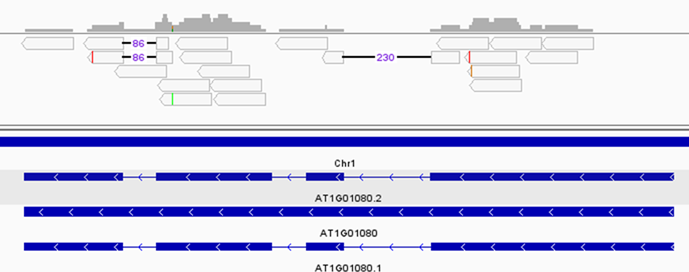
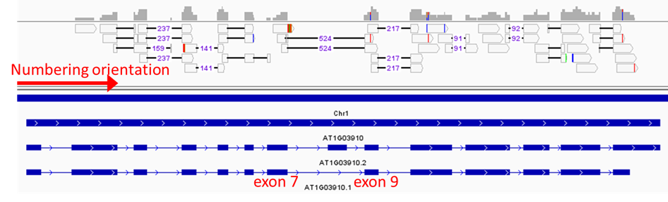

# Comparing alternative-splicing events using RackJ

This page will go through the following items using short read pair-ended datasets of three control samples and three treatment samples:
1. alternative-splicing event comparison between two merged samples
2. alternative-splicing evnet comparison based on ratios with respects to biological replicates

We will use [ExampleData.zip](https://data.depositar.io/en/dataset/exampledata-zip-20250930) and the [docker image](https://hub.docker.com/r/wdlin/rackj) for all the programs. In this walkthrough, we will use Singularity to run the docker image. Usage example:

```
wdlin@comp10:/RAID2/R418/20250930_AS$ curl -O https://data.depositar.io/en/dataset/75d0309f-5700-489a-afc0-85591aa3d7d3/resource/cb55dc2b-293a-4115-b6a7-5abca091d021/download/ExampleData.zip

wdlin@comp10:/RAID2/R418/20250930_AS$ unzip ExampleData.zip
Archive:  ExampleData.zip
   creating: ExampleData/
 extracting: ExampleData/control_rep1.merged.bam
 extracting: ExampleData/control_rep2.merged.bam
 extracting: ExampleData/control_rep4.merged.bam
 extracting: ExampleData/README.txt
   creating: ExampleData/src/
 extracting: ExampleData/src/control_rep1_R1.fq.gz
 extracting: ExampleData/src/control_rep1_R2.fq.gz
 extracting: ExampleData/src/control_rep2_R1.fq.gz
 extracting: ExampleData/src/control_rep2_R2.fq.gz
 extracting: ExampleData/src/control_rep4_R1.fq.gz
 extracting: ExampleData/src/control_rep4_R2.fq.gz
 extracting: ExampleData/src/treatment_rep5_R1.fq.gz
 extracting: ExampleData/src/treatment_rep5_R2.fq.gz
 extracting: ExampleData/src/treatment_rep7_R1.fq.gz
 extracting: ExampleData/src/treatment_rep7_R2.fq.gz
 extracting: ExampleData/src/treatment_rep9_R1.fq.gz
 extracting: ExampleData/src/treatment_rep9_R2.fq.gz
  inflating: ExampleData/tair10.strand.cgff
  inflating: ExampleData/tair10.strand.model
  inflating: ExampleData/TAIR10_chr_all.fas
  inflating: ExampleData/TAIR10_GFF3_genes_transposons.gff
 extracting: ExampleData/treatment_rep5.merged.bam
 extracting: ExampleData/treatment_rep7.merged.bam
 extracting: ExampleData/treatment_rep9.merged.bam

# this is to make sure the folder writable
wdlin@comp10:/RAID2/R418/20250930_AS$ chmod -R 755 ExampleData

wdlin@comp10:/RAID2/R418/20250930_AS$ cd ExampleData/

# this binds the ExampleData folder to /mnt in the container
wdlin@comp10:/RAID2/R418/20250930_AS/ExampleData$ singularity run --bind "$PWD:/mnt" docker://wdlin/rackj
INFO:    Using cached SIF image

Singularity> cd /mnt/
Singularity> ls
README.txt                         TAIR10_chr_all.fas       control_rep2.merged.bam  src                 tair10.strand.model        treatment_rep7.merged.bam
TAIR10_GFF3_genes_transposons.gff  control_rep1.merged.bam  control_rep4.merged.bam  tair10.strand.cgff  treatment_rep5.merged.bam  treatment_rep9.merged.bam
```

Note that the `ExampleData` folder was bounded as `/mnt` in the container. All necessary programs should be available so no need to do any installation. Also note the raw reads in this dataset contains only very small part of adapters so the adapter removal was not applied.

For Docker and Docker Desktop user:
1. extract ExampleData.zip and remember the path to the ExampleData folder
2. (only for Docker Desktop) open _terminal_ (bottom-right corner of Docker Desktop)
3. run command `docker run -it --rm --mount type=bind,src=<path_to_ExampleData>,dst=/mnt wdlin/rackj`
4. just remember that the ExampleData folder is bound to `/mnt`

The maximum memory usage is about 2GB for this workthrough so it seems not needed to adjust any resource limits.

## 1. Mapping using BLAT

**This is an optional step**. You may adopt `*.merged.bam` in ExampleData.zip directly. 

In case that we are going to map reads, existing BAM files are no longer needed.
```
rm *.bam
```

Build indexes for `BioPerl` and `samtools`. This is strongly suggested for avoiding race condition in case you are going to submit mapping commands to a job scheduler like slurm.
```
preindex.pl TAIR10_chr_all.fas
```

Since we have pair-ended raw read files `src/*.fq.gz`,
```
Singularity> ls -l src/*.fq.gz
-rwxr-xr-x+ 1 wdlin R418 21454332 Oct  4  2021 src/control_rep1_R1.fq.gz
-rwxr-xr-x+ 1 wdlin R418 22753585 Oct  4  2021 src/control_rep1_R2.fq.gz
-rwxr-xr-x+ 1 wdlin R418 21983578 Oct  4  2021 src/control_rep2_R1.fq.gz
-rwxr-xr-x+ 1 wdlin R418 23494113 Oct  4  2021 src/control_rep2_R2.fq.gz
-rwxr-xr-x+ 1 wdlin R418 20786103 Oct  4  2021 src/control_rep4_R1.fq.gz
-rwxr-xr-x+ 1 wdlin R418 21921178 Oct  4  2021 src/control_rep4_R2.fq.gz
-rwxr-xr-x+ 1 wdlin R418 20703897 Oct  4  2021 src/treatment_rep5_R1.fq.gz
-rwxr-xr-x+ 1 wdlin R418 21943326 Oct  4  2021 src/treatment_rep5_R2.fq.gz
-rwxr-xr-x+ 1 wdlin R418 21909066 Oct  4  2021 src/treatment_rep7_R1.fq.gz
-rwxr-xr-x+ 1 wdlin R418 23300279 Oct  4  2021 src/treatment_rep7_R2.fq.gz
-rwxr-xr-x+ 1 wdlin R418 21281263 Oct  4  2021 src/treatment_rep9_R1.fq.gz
-rwxr-xr-x+ 1 wdlin R418 22591761 Oct  4  2021 src/treatment_rep9_R2.fq.gz
```

the following perl one-liner can help us to form 12 commands of running BLAT via rackj scripts `Mapping.pl` and `MappingBlat.pl`.
```
ls src/*.fq.gz | perl -ne 'chomp; /.+\/(.+?)\./; $cmd="gzip -dc $_ > $1.fq; Mapping.pl -split 4 x $1.fq $1.blat.bam MappingBlat.pl -target TAIR10_chr_all.fas -t=dna -q=rna; rm $1.fq"; print "\nCMD: $cmd\n"; system $cmd'
```

For convenience, we will keep listing only the first commends in most of this walkthrough.
```
CMD: gzip -dc src/control_rep1_R1.fq.gz > control_rep1_R1.fq; Mapping.pl -split 4 x control_rep1_R1.fq control_rep1_R1.blat.bam MappingBlat.pl -target TAIR10_chr_all.fas -t=dna -q=rna; rm control_rep1_R1.fq
(... deleted)
```
Points to be noticed and parameter explanation:
1. BLAT accepts plain text FASTA files so we have `gzip -dc src/control_rep1_R1.fq.gz > control_rep1_R1.fq` and `rm control_rep1_R1.fq` at the beginning and the end, respectively.
2. `-split 4` asks `Mapping.pl` to split the read file into 4 shares and executes 4 `MappingBlat.pl` for them, respectively. Note that BLAT would build a lookup table of the genome in memory, this costs some memroy.
3. `x`: a dummy parameter, please keep it.
4. `control_rep1_R1.fq`: the read file.
5. `control_rep1_R1.blat.bam`: output BAM file, it would be sorted-by-name.
6. `-target TAIR10_chr_all.fas`: let `MappingBlat.pl` know the genome FASTA file so that it can invoke `blat` with this genome FASTA and using the genome FASTA when translating PSLx into SAM.
7. `-t=dna -q=rna`: parameters to be passed to `blat`. `-q=rna` for RNAseq reads.

Output BAM files of the last command would be `*.blat.bam`.
```
Singularity> ls -l *.blat.bam
-rwxrwxrwx+ 1 wdlin R418 20462399 Sep 21 13:54 control_rep1_R1.blat.bam
-rwxrwxrwx+ 1 wdlin R418 20337560 Sep 21 13:54 control_rep1_R2.blat.bam
-rwxrwxrwx+ 1 wdlin R418 20980407 Sep 21 13:54 control_rep2_R1.blat.bam
-rwxrwxrwx+ 1 wdlin R418 20874369 Sep 21 13:55 control_rep2_R2.blat.bam
-rwxrwxrwx+ 1 wdlin R418 19785876 Sep 21 13:55 control_rep4_R1.blat.bam
-rwxrwxrwx+ 1 wdlin R418 19655968 Sep 21 13:55 control_rep4_R2.blat.bam
-rwxrwxrwx+ 1 wdlin R418 19713120 Sep 21 13:55 treatment_rep5_R1.blat.bam
-rwxrwxrwx+ 1 wdlin R418 19576079 Sep 21 13:56 treatment_rep5_R2.blat.bam
-rwxrwxrwx+ 1 wdlin R418 20835627 Sep 21 13:56 treatment_rep7_R1.blat.bam
-rwxrwxrwx+ 1 wdlin R418 20736819 Sep 21 13:56 treatment_rep7_R2.blat.bam
-rwxrwxrwx+ 1 wdlin R418 20219439 Sep 21 13:57 treatment_rep9_R1.blat.bam
-rwxrwxrwx+ 1 wdlin R418 20108811 Sep 21 13:57 treatment_rep9_R2.blat.bam
```

As they are read alignment files of read1 and read2 separately for each of the samples, the next command would generate 6 commands to merge them and keep the BAM file sorted-by-name.
```
ls *.blat.bam | perl -ne 'chomp; /(.+?)_R\d\./; push @{$hash{$1}},$_; if(eof){ for $key (sort keys %hash){ $cmd="samtools merge -fn /dev/stdout @{$hash{$key}} | samtools view /dev/stdin | SamReverse.pl _1 | samtools view -Sbo $key.merged.bam -T TAIR10_chr_all.fas /dev/stdin"; print "\nCMD: $cmd\n"; system $cmd } }'
```

Generated commands should be like:
```
CMD: samtools merge -fn /dev/stdout control_rep1_R1.blat.bam control_rep1_R2.blat.bam | samtools view /dev/stdin | SamReverse.pl _1 | samtools view -Sbo control_rep1.merged.bam -T TAIR10_chr_all.fas /dev/stdin
(... deleted)
```
Points to be noticed and parameter explanation:
1. `samtools merge -fn /dev/stdout control_rep1_R1.blat.bam control_rep1_R2.blat.bam`: merges two BAM files and write into `/dev/stdout`. We need `-f` to force write into the existing `/dev/stdout`. We also need `-n` because the two input BAM files are sorted-by-name.
2. `samtools view /dev/stdin | SamReverse.pl _1`: In pair-ended RNAseq, read1 and read2 are usually opposite to each other. In this example, our read2 reads are following gene orientation and read1 reads are opposite to the gene orientation. `samtools view /dev/stdin` translates BAM into SAM and `SamReverse.pl _1` reverses directions of read1 alignments. (*)
3. `samtools view -Sbo`: this last part translates read1-reversed input SAM into BAM.

(*): In case you are using alignment tools that align read1 and read2 at the same time (ex: TopHat2 or HISAT2), use `SamReverse.pl -byFlag 64` for reverse read1 directions.

**NOTE**: Many programs of rackj try to pick the most appropriate alignment(s) for one read so BAM files sorted-by-name are required. Most RNAseq-related programs of rackj can count reads for genes with cares of read orientations so making reads following original transcript orientation would improve precision of counting.

Now we have 6 `*.merged.bam` files, each of them corresponds to one sample.
```
Singularity> ls -l *.merged.bam
-rwxrwxrwx+ 1 wdlin R418 37814246 Sep 21 14:40 control_rep1.merged.bam
-rwxrwxrwx+ 1 wdlin R418 38837864 Sep 21 14:41 control_rep2.merged.bam
-rwxrwxrwx+ 1 wdlin R418 36550185 Sep 21 14:41 control_rep4.merged.bam
-rwxrwxrwx+ 1 wdlin R418 36394270 Sep 21 14:41 treatment_rep5.merged.bam
-rwxrwxrwx+ 1 wdlin R418 38590467 Sep 21 14:41 treatment_rep7.merged.bam
-rwxrwxrwx+ 1 wdlin R418 37492552 Sep 21 14:41 treatment_rep9.merged.bam
```

## 2. Visualization of read alignments and the gudided assembly

**This is an optional step**.

Since `*.merged.bam` files are sorted-by-name. We need to sort them by position and build indexes if we like to visualize read alignments to the genome. The following perl one-liner generates 6 commands for sorting the BAM files.
```
ls *.merged.bam | perl -ne 'chomp; /(.+?)\./; $cmd="samtools sort -o $1.sorted.bam $_"; print "\nCMD: $cmd\n"; system $cmd'
```

Generated commands would be like this:
```
CMD: samtools sort -o control_rep1.sorted.bam control_rep1.merged.bam
(deleted...)
```

The next perl one-liner generates commands for building indexes.
```
Singularity> ls *.sorted.bam | perl -ne 'chomp; $cmd="samtools index $_"; print "$cmd\n"; system $cmd'
```

With files `TAIR10_chr_all.fas`, `TAIR10_GFF3_genes_transposons.gff`, `*.sorted.bam`, and `*.sorted.bam.bai` available in a desktop computer, we can get read alignment visualization with the genome annotation by the following steps:
1. From IGV menu, Genomes -> Load Genome from File, pick `TAIR10_chr_all.fas`. This should load chromosome sequences.
2. File -> Load from File, pick `TAIR10_GFF3_genes_transposons.gff`. This should load the genome annotation made by the guided assembly.
3. File -> Load from File, pick `*.sorted.bam`. This should load read alignment files of the 6 samples.

## 3. Extract gene-exon coordinates

**This is an optional step**. You may adopt `tair10.strand.cgff` and `tair10.strand.model` in ExampleData.zip directly.

Our first step here is to observe the feature hierarchy inside the genome annotation GFF3 file `TAIR10_GFF3_genes_transposons.gff`.
```
java misc.GffTree -I TAIR10_GFF3_genes_transposons.gff
```

The above command asks `misc.GffTree` to parse `TAIR10_GFF3_genes_transposons.gff` and generate a `.features` file. Please note that we applied some strict rules on parsing GFF3 files so the program may report some issues for other GFF3 files. Please refer [here](https://github.com/wdlingit/gff3fixes) for a few examples of fixing GFF3 files, or consider raising an issue for an unparsable GFF3 file.
```
Singularity> cat TAIR10_GFF3_genes_transposons.gff.features
GffRoot
  chromosome*
  gene*
    mRNA*
      protein*
        CDS
      exon
      five_prime_UTR
      CDS
      three_prime_UTR
    miRNA*
      exon
    tRNA*
      exon
    ncRNA*
      exon
    snoRNA*
      exon
    snRNA*
      exon
    rRNA*
      exon
  pseudogene*
    pseudogenic_transcript*
      pseudogenic_exon
  transposable_element_gene*
    mRNA*
      exon
  transposable_element*
    transposon_fragment
    transposable_element_gene*
      mRNA*
        exon
```

According to our understanding, a gene locus can have a number of mRNA models (transcripts) and a model is defined by a number of exons. This is why we see `mRNA` under `gene` and `exon` (and some other features) under `mRNA` in the feature hierarchy. We know an RNA-level feature's sequence composition if we know its exon-level features' sequences. Accordingly, identifying all relationships like gene-mRNA-exon that would be involved in transcription should help our RNAseq study because these relationships can help us to know coordinates of genes and transcripts and we can count their reads from the BAM files in the last session. The following command helps us to extract all those coordinates.
```
java misc.ModelCGFF -GFF3 TAIR10_GFF3_genes_transposons.gff -GRE gene mRNA:miRNA:tRNA:ncRNA:snoRNA:snRNA:rRNA exon -GRE pseudogene pseudogenic_transcript pseudogenic_exon -GRE transposable_element_gene mRNA exon -O tair10.strand
```

This command's screen output should be:
```
ID attribute (-idAttr) not assigned, using default: ID
parent attribute list (-parentAttr) not assigned, using default: [Parent, Derives_from]
program: ModelCGFF
GFF3 filename (-GFF3): TAIR10_GFF3_genes_transposons.gff
ID attribute (-idAttr): ID
parent attribute list (-parentAttr)): [Parent, Derives_from]
gene-rna-exon feature triples (-GRE): [[gene, mRNA:miRNA:tRNA:ncRNA:snoRNA:snRNA:rRNA, exon], [pseudogene, pseudogenic_transcript, pseudogenic_exon], [transposable_element_gene, mRNA, exon]]
intron preserving merged model (-IP)): false
representative list (-rep): null
output prefix (-O): tair10.strand
```

The above `misc.ModelCGFF` command means: (i) collect all `exon` coordinates for `mRNA` `miRNA` `tRNA` `ncRNA` `snoRNA` `snRNA` `rRNA` and collect all `exon` coordinates of these `mRNA` `miRNA` `tRNA` `ncRNA` `snoRNA` `snRNA` `rRNA` for their genes (ii) collect `pseudogenic_exon` coordinates for `pseudogenic_transcript` and collect `pseudogenic_exon` coordinates of `pseudogenic_transcript` for `pseudogene`, and (iii) collect `exon` coordinates for `mRNA` belonging to `transposable_element_gene` and `transposable_element_gene`. The output coordinates would be two files, one for transcripts' exon coordinates and the other for genes' exon coordinates. The two filenames would be prefixed by `tair10.strand` and suffixed by `.model` and `.cgff`, respectively.

Here are one short example of `AT1G01020`.
```
Singularity> head -27 tair10.strand.model | tail -n 20
>AT1G01020.1    Chr1    5928    8737    -       AT1G01020
5928    6263
6437    7069
7157    7232
7384    7450
7564    7649
7762    7835
7942    7987
8236    8325
8417    8464
8571    8737
>AT1G01020.2    Chr1    6790    8737    -       AT1G01020
6790    7069
7157    7450
7564    7649
7762    7835
7942    7987
8236    8325
8417    8464
8571    8737

Singularity> head -17 tair10.strand.cgff | tail -n 10
>AT1G01020      Chr1    5928    8737    -
5928    6263
6437    7069
7157    7450
7564    7649
7762    7835
7942    7987
8236    8325
8417    8464
8571    8737
```

The above output shows that `gene` `AT1G01020` has two `transcripts` `AT1G01020.1` and `AT1G01020.2`. In `tair10.strand.model` we can see exon coordinates of the two transcripts. We can also see that the exon coordinates of `gene` `AT1G01020` is a _merge_ of exon coordinates of its two transcripts: `[5928, 6263]` absent in `AT1G01020.2` and `[7157, 7450]` is absent in `AT1G01020.1` (which covers `[7157, 7232]` and `[7384, 7450]`).

**NOTE**: In practice, we usually set option `-IP` to `true` for program `misc.ModelCGFF` to preserve intron information in genes' _merged_ exon coordinates.

## 4. Compute basic numbers

From the last two sections, we have BAM files storing reads mapping to where of the genome and coordinate files storing where genes and transcripts located in the genome. Together them we can compute various kind of numbers of reads for genes and transcripts. The next perl one-liner generates 6 commands that use `ASnumbers.pl` to generate many kinds of numbers for the alternative-splicing computation for the 6 samples.
```
ls *.merged.bam | perl -ne 'chomp; /(.+?)\./; push @{$hash{$1}},$_; if(eof){ for $key (sort keys %hash){ $cmd="ASnumbers.pl -model tair10.strand.model tair10.strand.cgff $key @{$hash{$key}} > $key.numbers.log"; print "\nCMD: $cmd\n"; system "$cmd"; } }'
```
```
CMD: ASnumbers.pl -model tair10.strand.model tair10.strand.cgff control_rep1 control_rep1.merged.bam > control_rep1.numbers.log
(deleted...)
```
Points to be noticed and parameter explanation:
1. option `-model tair10.strand.model` is provided for the alternative donor-acceptor computation. It can be omitted.
2. the first parameter `tair10.strand.cgff` is requried for exon coordinates of genes.
3. the second parameter (ex: `control_rep1`) is for the prefix of output files.
4. rest parameters shoudl be BAM files.

In addition to compupte all the numbers for 6 samples sepearately, we compute the same numbers for the two merged sample. The following perl one-liner merges the three replicates for each of the sample and generates a corresponding `ASnumbers.pl` command.
```
ls *.merged.bam | perl -ne 'chomp; /(.+?)_rep/; push @{$hash{$1}},$_; if(eof){ for $key (sort keys %hash){ $cmd="ASnumbers.pl -model tair10.strand.model tair10.strand.cgff $key @{$hash{$key}} > $key.numbers.log"; print "\nCMD: $cmd\n"; system "$cmd"; } }'
```

The two generated commands should be:
```
CMD: ASnumbers.pl -model tair10.strand.model tair10.strand.cgff control control_rep1.merged.bam control_rep2.merged.bam control_rep4.merged.bam > control.numbers.log

CMD: ASnumbers.pl -model tair10.strand.model tair10.strand.cgff treatment treatment_rep5.merged.bam treatment_rep7.merged.bam treatment_rep9.merged.bam > treatment.numbers.log
```

Rest part of this section describes files been used for the alternative-splicing comparisons.

### `.geneRPKM`

This file contains five columns:
1. GeneID: gene ID
2. Length(Kbps): gene length in Kbps
3. #Reads: number of mapped reads, including fractions of multi-reads (*)
4. RPKM: within sample normalized RPKM value (*)
5. multi/ALL: ratio of multi-reads versus all reads

*: Computed following the description in Mortazavi A, et al. Nat Methods. 2008. (PMID: 18516045). Seperate every multi-read to mapped genes according to gene expression levels inferred by uniq-reads.

A example is `AT1G01080` of sample control_rep1. In file `control_rep1.geneRPKM` it was found that

| GeneID | Length(Kbps) | #Reads | RPKM | multi/ALL |
|:-------|-------------:|-------:|-----:|----------:|
| AT1G01080 | 1.322 | 20.0 | 30.43 | 0.0 |

In the IGV interface, we can see there are exactly 20 reads. According to column 5, multi-read ratio is 0 so we know all 20 reads are uniq-reads.


### `.spliceCount`

This file contains six columns:
1. GeneID: gene ID
2. exonPair: exon pair, in the form of _a<=>b_
3. #reads: number of reads supporting this splicing event
4. jumping: is there any other exon between a and b?
5. novel: is this splicing event novel? (this column is added if `-model` specified)
6. splicingPosFreq: splicing position fequency of reads

A example is `AT1G03910` exon pair `7<=>9`. In file `control_rep1.spliceCount` it was found that

| GeneID | exonPair | #reads | jumping | novel | splicingPosFreq |
|:-------|:--------:|-------:|:-------:|:-----:|:----------------|
| AT1G03910 | 7<=>9 | 2.0 | V | | {45=1, 70=1} |

In the IGV interface, we can see there are exactly 2 spliced reads with the first part at exon 7 and the second part at exon 9, where exon 8 was skipped. As the gene model `AT1G03910.1` is agreeing with this exon skipping, this exon skipping is not novel.


### `.fineSplice`
### `.depth.intronCount` and `.depth.exonCount`

| Column 1 | Column 2 | Column 3 |
|----------|----------|----------|
| Row 1    | Data     | More     |
| Row 2    | Info     | Stuff    |

## 5. Alternative-splicing event comparison between two merged samples

```
AScomp_merged.pl tair10.strand.cgff control treatment
```

## 6. Alternative-splicing evnet comparison based on ratios with respects to biological replicates

```
AScomp_separate.pl tair10.strand.cgff control:control_rep1,control_rep2,control_rep4 treatment:treatment_rep5,treatment_rep7,treatment_rep9
```
