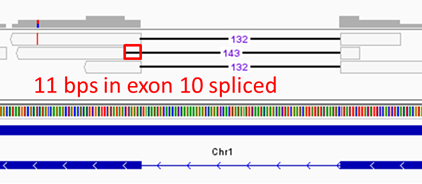

# Comparing alternative-splicing events using RackJ

This page will go through the following items using short read pair-ended datasets of three control samples and three treatment samples:
1. alternative-splicing event comparison between two merged samples
2. alternative-splicing evnet comparison based on ratios with respects to biological replicates

We will use [ExampleData.zip](https://data.depositar.io/en/dataset/exampledata-zip-20250930) and the [docker image](https://hub.docker.com/r/wdlin/rackj) for all the programs. In this walkthrough, we will use Singularity to run the docker image. Usage example:

```
wdlin@comp10:/RAID2/R418/20250930_AS$ curl -O https://data.depositar.io/en/dataset/75d0309f-5700-489a-afc0-85591aa3d7d3/resource/cb55dc2b-293a-4115-b6a7-5abca091d021/download/ExampleData.zip

wdlin@comp10:/RAID2/R418/20250930_AS$ unzip ExampleData.zip
Archive:  ExampleData.zip
   creating: ExampleData/
 extracting: ExampleData/control_rep1.merged.bam
 extracting: ExampleData/control_rep2.merged.bam
 extracting: ExampleData/control_rep4.merged.bam
 extracting: ExampleData/README.txt
   creating: ExampleData/src/
 extracting: ExampleData/src/control_rep1_R1.fq.gz
 extracting: ExampleData/src/control_rep1_R2.fq.gz
 extracting: ExampleData/src/control_rep2_R1.fq.gz
 extracting: ExampleData/src/control_rep2_R2.fq.gz
 extracting: ExampleData/src/control_rep4_R1.fq.gz
 extracting: ExampleData/src/control_rep4_R2.fq.gz
 extracting: ExampleData/src/treatment_rep5_R1.fq.gz
 extracting: ExampleData/src/treatment_rep5_R2.fq.gz
 extracting: ExampleData/src/treatment_rep7_R1.fq.gz
 extracting: ExampleData/src/treatment_rep7_R2.fq.gz
 extracting: ExampleData/src/treatment_rep9_R1.fq.gz
 extracting: ExampleData/src/treatment_rep9_R2.fq.gz
  inflating: ExampleData/tair10.strand.cgff
  inflating: ExampleData/tair10.strand.model
  inflating: ExampleData/TAIR10_chr_all.fas
  inflating: ExampleData/TAIR10_GFF3_genes_transposons.gff
 extracting: ExampleData/treatment_rep5.merged.bam
 extracting: ExampleData/treatment_rep7.merged.bam
 extracting: ExampleData/treatment_rep9.merged.bam

# this is to make sure the folder writable
wdlin@comp10:/RAID2/R418/20250930_AS$ chmod -R 755 ExampleData

wdlin@comp10:/RAID2/R418/20250930_AS$ cd ExampleData/

# this binds the ExampleData folder to /mnt in the container
wdlin@comp10:/RAID2/R418/20250930_AS/ExampleData$ singularity run --bind "$PWD:/mnt" docker://wdlin/rackj
INFO:    Using cached SIF image

Singularity> cd /mnt/
Singularity> ls
README.txt                         TAIR10_chr_all.fas       control_rep2.merged.bam  src                 tair10.strand.model        treatment_rep7.merged.bam
TAIR10_GFF3_genes_transposons.gff  control_rep1.merged.bam  control_rep4.merged.bam  tair10.strand.cgff  treatment_rep5.merged.bam  treatment_rep9.merged.bam
```

Note that the `ExampleData` folder was bounded as `/mnt` in the container. All necessary programs should be available so no need to do any installation. Also note the raw reads in this dataset contains only very small part of adapters so the adapter removal was not applied.

For Docker and Docker Desktop user:
1. extract ExampleData.zip and remember the path to the ExampleData folder
2. (only for Docker Desktop) open _terminal_ (bottom-right corner of Docker Desktop)
3. run command `docker run -it --rm --mount type=bind,src=<path_to_ExampleData>,dst=/mnt wdlin/rackj`
4. just remember that the ExampleData folder is bound to `/mnt`

The maximum memory usage is about 2GB for this workthrough so it seems not needed to adjust any resource limits.

## 1. Mapping using BLAT

**This is an optional step**. You may adopt `*.merged.bam` in ExampleData.zip directly. 

In case that we are going to map reads, existing BAM files are no longer needed.
```
rm *.bam
```

Build indexes for `BioPerl` and `samtools`. This is strongly suggested for avoiding race condition in case you are going to submit mapping commands to a job scheduler like slurm.
```
preindex.pl TAIR10_chr_all.fas
```

Since we have pair-ended raw read files `src/*.fq.gz`,
```
Singularity> ls -l src/*.fq.gz
-rwxr-xr-x+ 1 wdlin R418 21454332 Oct  4  2021 src/control_rep1_R1.fq.gz
-rwxr-xr-x+ 1 wdlin R418 22753585 Oct  4  2021 src/control_rep1_R2.fq.gz
-rwxr-xr-x+ 1 wdlin R418 21983578 Oct  4  2021 src/control_rep2_R1.fq.gz
-rwxr-xr-x+ 1 wdlin R418 23494113 Oct  4  2021 src/control_rep2_R2.fq.gz
-rwxr-xr-x+ 1 wdlin R418 20786103 Oct  4  2021 src/control_rep4_R1.fq.gz
-rwxr-xr-x+ 1 wdlin R418 21921178 Oct  4  2021 src/control_rep4_R2.fq.gz
-rwxr-xr-x+ 1 wdlin R418 20703897 Oct  4  2021 src/treatment_rep5_R1.fq.gz
-rwxr-xr-x+ 1 wdlin R418 21943326 Oct  4  2021 src/treatment_rep5_R2.fq.gz
-rwxr-xr-x+ 1 wdlin R418 21909066 Oct  4  2021 src/treatment_rep7_R1.fq.gz
-rwxr-xr-x+ 1 wdlin R418 23300279 Oct  4  2021 src/treatment_rep7_R2.fq.gz
-rwxr-xr-x+ 1 wdlin R418 21281263 Oct  4  2021 src/treatment_rep9_R1.fq.gz
-rwxr-xr-x+ 1 wdlin R418 22591761 Oct  4  2021 src/treatment_rep9_R2.fq.gz
```

the following perl one-liner can help us to form 12 commands of running BLAT via rackj scripts `Mapping.pl` and `MappingBlat.pl`.
```
ls src/*.fq.gz | perl -ne 'chomp; /.+\/(.+?)\./; $cmd="gzip -dc $_ > $1.fq; Mapping.pl -split 4 x $1.fq $1.blat.bam MappingBlat.pl -target TAIR10_chr_all.fas -t=dna -q=rna > $1.log; rm $1.fq"; print "\nCMD: $cmd\n"; system $cmd'
```

For convenience, we will keep listing only the first commends in most of this walkthrough.
```
CMD: gzip -dc src/control_rep1_R1.fq.gz > control_rep1_R1.fq; Mapping.pl -split 4 x control_rep1_R1.fq control_rep1_R1.blat.bam MappingBlat.pl -target TAIR10_chr_all.fas -t=dna -q=rna > control_rep1_R1.log; rm control_rep1_R1.fq
(... deleted)
```
Points to be noticed and parameter explanation:
1. BLAT accepts plain text FASTA files so we have `gzip -dc src/control_rep1_R1.fq.gz > control_rep1_R1.fq` and `rm control_rep1_R1.fq` at the beginning and the end, respectively.
2. `-split 4` asks `Mapping.pl` to split the read file into 4 shares and executes 4 `MappingBlat.pl` for them, respectively. Note that BLAT would build a lookup table of the genome in memory, this costs some memroy.
3. `x`: a dummy parameter, please keep it.
4. `control_rep1_R1.fq`: the read file.
5. `control_rep1_R1.blat.bam`: output BAM file, it would be sorted-by-name.
6. `-target TAIR10_chr_all.fas`: let `MappingBlat.pl` know the genome FASTA file so that it can invoke `blat` with this genome FASTA and using the genome FASTA when translating PSLx into SAM.
7. `-t=dna -q=rna`: parameters to be passed to `blat`. `-q=rna` for RNAseq reads.

Output BAM files of the last command would be `*.blat.bam`.
```
Singularity> ls -l *.blat.bam
-rwxrwxrwx+ 1 wdlin R418 20462399 Sep 21 13:54 control_rep1_R1.blat.bam
-rwxrwxrwx+ 1 wdlin R418 20337560 Sep 21 13:54 control_rep1_R2.blat.bam
-rwxrwxrwx+ 1 wdlin R418 20980407 Sep 21 13:54 control_rep2_R1.blat.bam
-rwxrwxrwx+ 1 wdlin R418 20874369 Sep 21 13:55 control_rep2_R2.blat.bam
-rwxrwxrwx+ 1 wdlin R418 19785876 Sep 21 13:55 control_rep4_R1.blat.bam
-rwxrwxrwx+ 1 wdlin R418 19655968 Sep 21 13:55 control_rep4_R2.blat.bam
-rwxrwxrwx+ 1 wdlin R418 19713120 Sep 21 13:55 treatment_rep5_R1.blat.bam
-rwxrwxrwx+ 1 wdlin R418 19576079 Sep 21 13:56 treatment_rep5_R2.blat.bam
-rwxrwxrwx+ 1 wdlin R418 20835627 Sep 21 13:56 treatment_rep7_R1.blat.bam
-rwxrwxrwx+ 1 wdlin R418 20736819 Sep 21 13:56 treatment_rep7_R2.blat.bam
-rwxrwxrwx+ 1 wdlin R418 20219439 Sep 21 13:57 treatment_rep9_R1.blat.bam
-rwxrwxrwx+ 1 wdlin R418 20108811 Sep 21 13:57 treatment_rep9_R2.blat.bam
```

As they are read alignment files of read1 and read2 separately for each of the samples, the next command would generate 6 commands to merge them and keep the BAM file sorted-by-name.
```
ls *.blat.bam | perl -ne 'chomp; /(.+?)_R\d\./; push @{$hash{$1}},$_; if(eof){ for $key (sort keys %hash){ $cmd="samtools merge -fn /dev/stdout @{$hash{$key}} | samtools view /dev/stdin | SamReverse.pl _1 | samtools view -Sbo $key.merged.bam -T TAIR10_chr_all.fas /dev/stdin"; print "\nCMD: $cmd\n"; system $cmd } }'
```

Generated commands should be like:
```
CMD: samtools merge -fn /dev/stdout control_rep1_R1.blat.bam control_rep1_R2.blat.bam | samtools view /dev/stdin | SamReverse.pl _1 | samtools view -Sbo control_rep1.merged.bam -T TAIR10_chr_all.fas /dev/stdin
(... deleted)
```
Points to be noticed and parameter explanation:
1. `samtools merge -fn /dev/stdout control_rep1_R1.blat.bam control_rep1_R2.blat.bam`: merges two BAM files and write into `/dev/stdout`. We need `-f` to force write into the existing `/dev/stdout`. We also need `-n` because the two input BAM files are sorted-by-name.
2. `samtools view /dev/stdin | SamReverse.pl _1`: In pair-ended RNAseq, read1 and read2 are usually opposite to each other. In this example, our read2 reads are following gene orientation and read1 reads are opposite to the gene orientation. `samtools view /dev/stdin` translates BAM into SAM and `SamReverse.pl _1` reverses directions of read1 alignments. (*)
3. `samtools view -Sbo`: this last part translates read1-reversed input SAM into BAM.

(*): In case you are using alignment tools that align read1 and read2 at the same time (ex: TopHat2 or HISAT2), use `SamReverse.pl -byFlag 64` for reverse read1 directions.

**NOTE**: Many programs of rackj try to pick the most appropriate alignment(s) for one read so BAM files sorted-by-name are required. Most RNAseq-related programs of rackj can count reads for genes with cares of read orientations so making reads following original transcript orientation would improve precision of counting.

Now we have 6 `*.merged.bam` files, each of them corresponds to one sample.
```
Singularity> ls -l *.merged.bam
-rwxrwxrwx+ 1 wdlin R418 37814246 Sep 21 14:40 control_rep1.merged.bam
-rwxrwxrwx+ 1 wdlin R418 38837864 Sep 21 14:41 control_rep2.merged.bam
-rwxrwxrwx+ 1 wdlin R418 36550185 Sep 21 14:41 control_rep4.merged.bam
-rwxrwxrwx+ 1 wdlin R418 36394270 Sep 21 14:41 treatment_rep5.merged.bam
-rwxrwxrwx+ 1 wdlin R418 38590467 Sep 21 14:41 treatment_rep7.merged.bam
-rwxrwxrwx+ 1 wdlin R418 37492552 Sep 21 14:41 treatment_rep9.merged.bam
```

## 2. Visualization of read alignments and the gudided assembly

**This is an optional step**.

Since `*.merged.bam` files are sorted-by-name. We need to sort them by position and build indexes if we like to visualize read alignments to the genome. The following perl one-liner generates 6 commands for sorting the BAM files.
```
ls *.merged.bam | perl -ne 'chomp; /(.+?)\./; $cmd="samtools sort -o $1.sorted.bam $_"; print "\nCMD: $cmd\n"; system $cmd'
```

Generated commands would be like this:
```
CMD: samtools sort -o control_rep1.sorted.bam control_rep1.merged.bam
(deleted...)
```

The next perl one-liner generates commands for building indexes.
```
Singularity> ls *.sorted.bam | perl -ne 'chomp; $cmd="samtools index $_"; print "$cmd\n"; system $cmd'
```

With files `TAIR10_chr_all.fas`, `TAIR10_GFF3_genes_transposons.gff`, `*.sorted.bam`, and `*.sorted.bam.bai` available in a desktop computer, we can get read alignment visualization with the genome annotation by the following steps:
1. From IGV menu, Genomes -> Load Genome from File, pick `TAIR10_chr_all.fas`. This should load chromosome sequences.
2. File -> Load from File, pick `TAIR10_GFF3_genes_transposons.gff`. This should load the genome annotation made by the guided assembly.
3. File -> Load from File, pick `*.sorted.bam`. This should load read alignment files of the 6 samples.

## 3. Extract gene-exon coordinates

**This is an optional step**. You may adopt `tair10.strand.cgff` and `tair10.strand.model` in ExampleData.zip directly.

Our first step here is to observe the feature hierarchy inside the genome annotation GFF3 file `TAIR10_GFF3_genes_transposons.gff`.
```
java misc.GffTree -I TAIR10_GFF3_genes_transposons.gff
```

The above command asks `misc.GffTree` to parse `TAIR10_GFF3_genes_transposons.gff` and generate a `.features` file. Please note that we applied some strict rules on parsing GFF3 files so the program may report some issues for other GFF3 files. Please refer [here](https://github.com/wdlingit/gff3fixes) for a few examples of fixing GFF3 files, or consider raising an issue for an unparsable GFF3 file.
```
Singularity> cat TAIR10_GFF3_genes_transposons.gff.features
GffRoot
  chromosome*
  gene*
    mRNA*
      protein*
        CDS
      exon
      five_prime_UTR
      CDS
      three_prime_UTR
    miRNA*
      exon
    tRNA*
      exon
    ncRNA*
      exon
    snoRNA*
      exon
    snRNA*
      exon
    rRNA*
      exon
  pseudogene*
    pseudogenic_transcript*
      pseudogenic_exon
  transposable_element_gene*
    mRNA*
      exon
  transposable_element*
    transposon_fragment
    transposable_element_gene*
      mRNA*
        exon
```

According to our understanding, a gene locus can have a number of mRNA models (transcripts) and a model is defined by a number of exons. This is why we see `mRNA` under `gene` and `exon` (and some other features) under `mRNA` in the feature hierarchy. We know an RNA-level feature's sequence composition if we know its exon-level features' sequences. Accordingly, identifying all relationships like gene-mRNA-exon that would be involved in transcription should help our RNAseq study because these relationships can help us to know coordinates of genes and transcripts and we can count their reads from the BAM files in the last session. The following command helps us to extract all those coordinates.
```
java misc.ModelCGFF -GFF3 TAIR10_GFF3_genes_transposons.gff -GRE gene mRNA:miRNA:tRNA:ncRNA:snoRNA:snRNA:rRNA exon -GRE pseudogene pseudogenic_transcript pseudogenic_exon -GRE transposable_element_gene mRNA exon -O tair10.strand
```

This command's screen output should be:
```
ID attribute (-idAttr) not assigned, using default: ID
parent attribute list (-parentAttr) not assigned, using default: [Parent, Derives_from]
program: ModelCGFF
GFF3 filename (-GFF3): TAIR10_GFF3_genes_transposons.gff
ID attribute (-idAttr): ID
parent attribute list (-parentAttr)): [Parent, Derives_from]
gene-rna-exon feature triples (-GRE): [[gene, mRNA:miRNA:tRNA:ncRNA:snoRNA:snRNA:rRNA, exon], [pseudogene, pseudogenic_transcript, pseudogenic_exon], [transposable_element_gene, mRNA, exon]]
intron preserving merged model (-IP)): false
representative list (-rep): null
output prefix (-O): tair10.strand
```

The above `misc.ModelCGFF` command means: (i) collect all `exon` coordinates for `mRNA` `miRNA` `tRNA` `ncRNA` `snoRNA` `snRNA` `rRNA` and collect all `exon` coordinates of these `mRNA` `miRNA` `tRNA` `ncRNA` `snoRNA` `snRNA` `rRNA` for their genes (ii) collect `pseudogenic_exon` coordinates for `pseudogenic_transcript` and collect `pseudogenic_exon` coordinates of `pseudogenic_transcript` for `pseudogene`, and (iii) collect `exon` coordinates for `mRNA` belonging to `transposable_element_gene` and `transposable_element_gene`. The output coordinates would be two files, one for transcripts' exon coordinates and the other for genes' exon coordinates. The two filenames would be prefixed by `tair10.strand` and suffixed by `.model` and `.cgff`, respectively.

Here are one short example of `AT1G01020`.
```
Singularity> head -27 tair10.strand.model | tail -n 20
>AT1G01020.1    Chr1    5928    8737    -       AT1G01020
5928    6263
6437    7069
7157    7232
7384    7450
7564    7649
7762    7835
7942    7987
8236    8325
8417    8464
8571    8737
>AT1G01020.2    Chr1    6790    8737    -       AT1G01020
6790    7069
7157    7450
7564    7649
7762    7835
7942    7987
8236    8325
8417    8464
8571    8737

Singularity> head -17 tair10.strand.cgff | tail -n 10
>AT1G01020      Chr1    5928    8737    -
5928    6263
6437    7069
7157    7450
7564    7649
7762    7835
7942    7987
8236    8325
8417    8464
8571    8737
```

The above output shows that `gene` `AT1G01020` has two `transcripts` `AT1G01020.1` and `AT1G01020.2`. In `tair10.strand.model` we can see exon coordinates of the two transcripts. We can also see that the exon coordinates of `gene` `AT1G01020` is a _merge_ of exon coordinates of its two transcripts: `[5928, 6263]` absent in `AT1G01020.2` and `[7157, 7450]` is absent in `AT1G01020.1` (which covers `[7157, 7232]` and `[7384, 7450]`).

**NOTE**: In practice, we usually set option `-IP` to `true` for program `misc.ModelCGFF` to preserve intron information in genes' _merged_ exon coordinates.

## 4. Compute basic numbers

From the last two sections, we have BAM files storing reads mapping to where of the genome and coordinate files storing where genes and transcripts located in the genome. Together them we can compute various kinds of numbers of reads for genes and transcripts. The next perl one-liner generates 6 commands that use `ASnumbers.pl` to generate files of numbers for the 6 samples for the alternative-splicing computation.
```
ls *.merged.bam | perl -ne 'chomp; /(.+?)\./; push @{$hash{$1}},$_; if(eof){ for $key (sort keys %hash){ $cmd="ASnumbers.pl -model tair10.strand.model tair10.strand.cgff $key @{$hash{$key}} > $key.numbers.log"; print "\nCMD: $cmd\n"; system "$cmd"; } }'
```
```
CMD: ASnumbers.pl -model tair10.strand.model tair10.strand.cgff control_rep1 control_rep1.merged.bam > control_rep1.numbers.log
(deleted...)
```
Points to be noticed and parameter explanation:
1. option `-model tair10.strand.model` is provided for the alternative donor-acceptor computation for deciding whether the genome annotation database contains a given splicing junction. It can be omitted.
2. the first parameter `tair10.strand.cgff` is requried for exon coordinates of genes.
3. the second parameter (ex: `control_rep1`) is for the prefix of output files.
4. rest parameters should be BAM files, sorted-by-name.

In addition to compupte all the numbers for 6 samples sepearately, we compute the same numbers for the two merged sample. The following perl one-liner merges the three replicates for each of the sample and generates a corresponding `ASnumbers.pl` command.
```
ls *.merged.bam | perl -ne 'chomp; /(.+?)_rep/; push @{$hash{$1}},$_; if(eof){ for $key (sort keys %hash){ $cmd="ASnumbers.pl -model tair10.strand.model tair10.strand.cgff $key @{$hash{$key}} > $key.numbers.log"; print "\nCMD: $cmd\n"; system "$cmd"; } }'
```

The two generated commands should be:
```
CMD: ASnumbers.pl -model tair10.strand.model tair10.strand.cgff control control_rep1.merged.bam control_rep2.merged.bam control_rep4.merged.bam > control.numbers.log

CMD: ASnumbers.pl -model tair10.strand.model tair10.strand.cgff treatment treatment_rep5.merged.bam treatment_rep7.merged.bam treatment_rep9.merged.bam > treatment.numbers.log
```

Rest part of this section describes files been used for the alternative-splicing comparisons.

### `.geneRPKM`

This file contains five columns:
1. GeneID: gene ID
2. Length(Kbps): gene length in Kbps
3. #Reads: number of mapped reads, including fractions of multi-reads (*)
4. RPKM: within sample normalized RPKM value (*)
5. multi/ALL: ratio of multi-reads versus all reads

*: Computed following the description in Mortazavi A, et al. Nat Methods. 2008. (PMID: 18516045). Seperate every multi-read to mapped genes according to gene expression levels inferred by uniq-reads.

A example is `AT1G01080` of sample control_rep1. In file `control_rep1.geneRPKM` it was found that

| GeneID | Length(Kbps) | #Reads | RPKM | multi/ALL |
|:-------|-------------:|-------:|-----:|----------:|
| AT1G01080 | 1.322 | 20.0 | 30.43 | 0.0 |

In the IGV interface, we can see there are exactly 20 reads. According to column 5, multi-read ratio is 0 so we know all 20 reads are uniq-reads.


### `.spliceCount`

This file contains six columns:
1. GeneID: gene ID
2. exonPair: exon pair, in the form of _a<=>b_ (*)
3. #reads: number of reads supporting this splicing event
4. jumping: is there any other exon between a and b?
5. novel: is this splicing event novel? (this column is added if `-model` specified)
6. splicingPosFreq: splicing position fequency of reads

*: In our framework, all exons and introns are numbered following chromosome orientation.

An example is `AT1G03910` exon pair `7<=>9`. In file `control_rep1.spliceCount` it was found that

| GeneID | exonPair | #reads | jumping | novel | splicingPosFreq |
|:-------|:--------:|-------:|:-------:|:-----:|:----------------|
| AT1G03910 | 7<=>9 | 2.0 | V | | {45=1, 70=1} |

In the IGV interface, we can see there are exactly 2 spliced reads with the first part at exon 7 and the second part at exon 9, where exon 8 was skipped. As the gene model `AT1G03910.1` is agreeing with this exon skipping, this exon skipping is not novel.


### `.fineSplice`

This file contains five columns:
1. GeneID: gene ID
2. splice: splicing pattern (*)
3. #reads: number of reads supporting this splicing event
4. novel: is this splicing event novel? (this column is added if `-model` specified)
5. splicingPosFreq: splicing position fequency of reads

*: We have a system of noting splicing junction with respect to relative positions to gene exons. Please refer [here](https://rackj.sourceforge.net/Manual/index.html#rnaseq.FineSpliceCounter) if needed.

An example is `AT1G01650` spliceing pattern `10(-11)-11(0)`. In short, the splicing pattern is saying 11bps at the exon 10 3' end was excluded. In file `control_rep1.fineSplice` it was found that

| GeneID | splice | #reads | novel | splicingPosFreq |
|:-------|:------:|-------:|:-----:|:----------------|
| AT1G01650 | 10(-11)-11(0) | 1.0 | V | {113=1} |

In the IGV interface, we can see there is one spliced read spanning exons 10 and 11 with 11bp-lack at the exon 10 end. As there is no existing gene model agreeing with this splicing junction, this splicing junction was marked novel.



### `.depth.intronCount` and `.depth.exonCount`

This two files are in the same format, one for read depths of introns, and the other for read depths of exons. Be sure to know that all intron/exon numbering are following chromosome orientation:
1. GeneID: gene ID
2. intronNo/exonNo: intron/exon number
3. depth: average read depth of every base-pair of the intron/exon
4. intronLen/exonLen: length of the intron/exon
5. multi/ALL: a compatibility column with non-depth `.intronCount` and `.exonCount` files. Should be all 0's here.
6. coveredRatio: the fraction that the intron/exon been covered by at least one read

### `.log`

In the mapping step, we have one `.log` file for each of the read1 and read2 files. In this session, we have one `.log` file for each execution of the `ASnumbers.pl` script. Checking them can help us to do some kind of quality checking. Take sample control_rep1 as the example.
```
Singularity> ls control_rep1*.log
control_rep1.numbers.log  control_rep1_R1.log  control_rep1_R2.log

Singularity> head -2 control_rep1_R1.log  control_rep1_R2.log
==> control_rep1_R1.log <==
Split processing...done
Total query reads: 255351

==> control_rep1_R2.log <==
Split processing...done
Total query reads: 255351
```
From above we see there are `255351+255351=510702` pair-ended reads in sample control_rep1.

```
Singularity> head -19 control_rep1.numbers.log
[2025-09-26 13:59:16] CMD: java rnaseq.RPKMComputer -GFF tair10.strand.cgff -model tair10.strand.model -M SAMun control_rep1.merged.bam -ID 0.9 -direction true -O control_rep1
program: RPKMComputer
canonical GFF filename (-GFF): tair10.strand.cgff
mapping method/filename (-M):
  SAMun : control_rep1.merged.bam
output prefix (-O): control_rep1
block join factor (-J): 2
identity cutoff (-ID): 0.9
use exon region (-exon): true
check by containing (-contain, FALSE for by intersecting): false
minimum overlap (-min): 8
check all alignment blocks (-ALL): true
care mapping direction (-direction): true
RPKM by gene-mapping reads only (-geneOnly): false
model filename (-model): tair10.strand.model

#uniq reads: 476205
#multi reads: 5829
#mapped reads: 497164
```
From above we can see that, for sample control_rep1, 497164 out of 510702 were mapped with identity greater than or equal to 0.9 (option `-ID`). This is about 97%. Also, within 497164 reads, `476205+5829=482034` were counted for some genes. This is also about 97%. Note that the gene counting procedure here counts only alignments agreeing gene orientation (`-direction` `true`) so it means that our read1-reverse operation in the mapping section is correct.

## 5. Alternative-splicing event comparison between two merged samples

The next command performs comparisons for three kinds of alternative-splicing events based on files generated in the last section for the two merged samples control and treatment.
```
AScomp_merged.pl tair10.strand.cgff control treatment
```

In this workthrough example, the command would generate tab-delimited text files named `SS{IR/ES/DA}m_control-treatment.xls` ("m" for merged) for the three kinds of alternative-splicing events. These files can be opened directed by Excel. Rest part of this session explains the three files. We assume these files were opened using Excel and Excel column names A, B, C, ... were used in the following descriptions.

### Intron-retention: SSIRm_control-treatment.xls

Column meanings:
- A. Gene ID
- B/C. the intron / its length
- D/E. read depths of the intron in the two samples
- F/G. average read depths of neighboring exons in the two samples
- H/I/J. chi-squared value (goodness-of-fit), corresponding P-value, and adjusted P-value
- K. the minimum averaged exon read depth
- L/M. fold-change (comparing intron depth against exon depth) / regulation direction
- N/O. portions of the intron been covered by any reads in the two samples

In this file, every row represents an intron, and there are four numbers (columns D~G) directly related with the comparison. The idea of the comparison is to take read depths of neighboring exons in the two samples (columns F & G) as the background, and see if read depths of the intron in the two samples (columns D & E) are not following the background. In other words, "not following the background" means "not proportional to the background". A significant p-value (column I) or adjusted p-value (column J) means such a preference to one of the two samples.

Sometimes the computation could be wrong simply because of erroneous intron annotation. For example, an intron in database but actually an exon. To filter out unreliable records, you may consider to set some of the constraints:
1. remove rows with low exonMIN (<1, column K), because low read depths of neighboring exons mean low effectiveness of the comparison
2. remove rows with exonMIN lower than intron read depths, because this might mean wrong database annotation
3. remove rows with two low (<0.7) covered fractions (columns N & O). Covered fraction means the region of introns been covered by any reads. An wrongly reported intron (by a significant p-value) may have low fraction values in both samples.

### Exon-skipping: SSESm_control-treatment.xls

Column meanings:
- A. Gene ID
- B. the splicing pattern of the exon skipping event
- C/D. numbers of reads supporting the exon-skipping event in the two samples
- E/F. numbers of reads not supporting the exon-skipping event in the two samples, i.e., reads involving at least one skipped exon and one boundary exon
- G/H/I. chi-squared value (goodness-of-fit), corresponding P-value, and adjusted P-value
- J/K. fold-change (comparing exon-skipping reads against non-exon-skipping reads) / regulation direction
- L/M. read-depths of uniq-reads in the two samples
- N/O. chi-squared value (goodness-of-fit) and corresponding P-value
- P/Q. fold-change (comparing exon-skipping reads against uniq-read-depths) / regulation direction

In this file, each row represents a non-consecutive exon pair, which were spanned by some reads in some samples. By "spanned" it means that a read was split into parts to be mapped to the genome, and these exon regions were mapped by two consecutive read parts. In other words, the spanning read skipped some exon(s) between the non-consecutive exon pairs, and we consider that the read is supporting the exon-skipping event (hereinafter, ES event). In column B, the two numbers are for the two non-consecutive exons (numbered in chromosome orientation, must refer the merged gene model). Columns C & D are read counts supporting the ES event (noted by column B) in the two samples, and columns E & F are read counts not supporting the ES event in the two samples. By "not supporting" it means a read is spanning from one of the non-consecutive exons to a skipped exon. For example, let's say the ES event is 3<=>5 (meaning exon 4 was skipped by some reads), a read was consider as not supporting the ES event means that it is spanning exons 3 & 4 or 4 & 5.

Accordingly, given an ES event, we have its supporting read counts and non-supporting read counts in columns C~F. Comparing them we have p-values and adjusted p-values in columns H & I (column G can be omitted). Generally speaking, a significant (adjusted) p-value means supporting read counts are not proportional to non-supporting read counts, and there should be a preference of the exon-skipping event to some sample. Fold-change at column J was computed by supporting_ratio_treatment/supporting_ratio_control, where supporting_ratio = #supporting_read/#non-supporting_read. For an enhanced (column K, regulation) ES event, its supporting_ratio_treatment is greater than supporting_ratio_control, means higher chance to have an ES transcript per transcription in the treatment sample. Similarly, a reduced ES event means lower chance to have an ES transcript per transcription in the treatment sample.

In some cases, an isoform containing ES event(s) could be the constitutional form. And, if some other form without ES is preferential to some sample, the above comparison could give significant p-value(s). To detect such false alarms, ES supporting read counts were compared to read depths (columns L & M) of the gene. The corresponding p-value (column O) should be significant if the ES event is not constitutional.

Suggested filtering criteria:
1. filter out rows with total reads from columns C~F less than or equal to 20 (or higher as you wish), for their low effectiveness of the comparison
2. pick rows with significant (adjusted) p-values at column H or I AND significant p-values at column O

### Donor-acceptor change: SSDAm_control-treatment.xls

Column meanings:
- A. Gene ID
- B/C. the splicing pattern (splice1) / is this splicing pattern in database
- D/E. the splicing pattern that is most deviated from splice1 (splice2) / is this splicing pattern in database
- F. the difference between splice1 and splice2 is of donor and/or acceptor
- G/H. numbers of reads supporting splice1 in the two samples
- I/J. numbers of reads not supporting splice1 in the two samples
- K/L. Fisher exact test P-value of G/H/I/J, adjusted P-value
- M/N. fold-change (comparing splice1 reads against non-splice1 reads) / regulation direction
- O/P. numbers of uniq-reads of the gene in the two samples
- Q. Fisher exact test P-value of G/H/O/P
- R/S. fold-change (comparing splice1 reads against uniq-reads) / regulation direction

In this file, each row represents a splicing junction (hereinafter, SJ), where this junction was inferred by some reads in some samples. Considering an SJ as two points in the chromosome, an SJ been included in the AS comparison must satisfy the following conditions:
1. both points in the same gene region: a point outside the gene means no reference exon for it
2. not in the same exon region: this means "intron in exon", which is rare. Our usage of intron-preserving gene model should avoid many such cases.

That is, we can always find two different and nearest exons for every computed SJ as reference exons and take their junction points as reference positions for noting the SJ. For example, 5(+1)-6(-2) means the transcription of 1 more bp of the 5th exon and 2 less bps of the 6th exon. For another example, 5(0)-6(0) is noting an SJ agreeing the junction between exons 5 & 6. In so doing, we are able to collect all SJs, as well as their supporting read counts, for every exon pairs. And for every SJ, we are able to identify its preference given that the two exons were expressed.

Back to file. Further explanations of some columns:
- B. splice1 is the SJ to be tested. The info in the merged gene model (BAM files and the `.cgff` file) should be helpful for obtaining the actual junction.
- D. splice2 is the most deviating SJ against splice1, given the same exon pair. Most deviating was done by comparing supporting read counts of splice1 in the two samples against supporting read counts of every other SJs of the same exon pair. The most significant SJ was picked as splice2. This data is not shown in the same row but usually the record of splice2 was listed in next few lines.
- E. similar with column C.
- GH. Number of splice1 supporting reads in the two samples
- IJ. Number of splice1 non-supporting reads in the two samples, given the same exon pair. "non-supporting" means reads express SJs other than splice1 and sharing the same exon pair.
- K. Comparing splice1 supporting read counts (columns G&H) by taking non-supporting read counts (columns I&J) as background. A significant p-value means supporting read counts are not proportional to non-supporting read counts, and there should be a preference of splice1 to some sample. Column L is for corresponding adjusted p-values.
- M. Fold-change was computed by supporting_ratio_treatment/supporting_ratio_control, where supporting_ratio = #supporting_read/#non-supporting_read.
- N. "enhanced" for higher chance to have a splice1-containing transcript per transcription in the treatment sample. Similarly, "reduced" for lower chance to have a splice1-containing transcript per transcription in the treatment sample.
- O~S. Similar to the above exon-skipping table. Splice1 can be contained by a constitutional form and there might be some false alarm. Columns O & P are uniq read counts of the gene in the two samples and column Q is p-value of comparing splice1 supporting read counts against uniq read counts.

Accordingly, similar suggestions with those for exon-skipping tables:
1. filter out rows with total reads from columns G~J less than or equal to 20 (or higher as you wish), for their low effectiveness of the comparison
2. pick rows with significant (adjusted) p-values at column K or L AND significant p-values at column Q

## 6. Alternative-splicing evnet comparison based on ratios with respects to biological replicates

Similar with the last section, the next command performs treatment-against-control comparisons for three kinds of alternative-splicing events based on files generated in the last-last section for the 6 separate samples.
```
AScomp_separate.pl tair10.strand.cgff control:control_rep1,control_rep2,control_rep4 treatment:treatment_rep5,treatment_rep7,treatment_rep9
```
Pointes to be noticed:
1. The two parameters `control:control_rep1,control_rep2,control_rep4` and `treatment:treatment_rep5,treatment_rep7,treatment_rep9` are in the form "merged_sample_name:separate_sample1,separate_sample2,..."
2. For each of the sample names (no matter merged or separate), a corresponding execution of `ASnumbers.pl` is required with exactly the same sample name.
3. `AScomp_separate.pl` requires output files of `AScomp_merged.pl`. 

In this workthrough example, the command would generate tab-delimited text files named `SS{IR/ES/DA}s_control-treatment.xls` ("s" for separate) for the three kinds of alternative-splicing events. These files can be opened directed by Excel. Rest part of this session explains the three files. We assume these files were opened using Excel.

### Intron-retention: SSIRs_control-treatment.xls

SSIRs files, columns were colored for easier description:
a. gene ID, intron number, and intron length
b. orange columns, average coverage depths of the intron in biological replicates
c. green columns, sums of average coverage depths of the two neighboring exons of the intron in biological replicates
d. orange columns, ratios of intron depths to exon depths
e. next 6 uncolored columns, T-test P-value that comparing treatment ratios against control ratios, adjusted P-value, regulation, fold-change (-1 for divide-by-zero), P-values by comparing the merged samples, and minimum average depths of neighboring exons
f. rest uncolored columns, fractions of the intron been covered by reads.

Note that P-values by comparing the merged samples (column SSIRm) can be considered as a confidence indicator that a small one (ex: <0.05) means enough evidence of the change.

### Exon-skipping: SSESs_control-treatment.xls

SSESs files, columns were colored for easier description:
a. In first few uncolored columns, there are info of the splicing pattern to be computed
b. orange columns, numbers of reads that support the splicing pattern
c. green columns, numbers of reads that are NOT supporting the splicing pattern
d. orange columns, depths of the gene, for expression levels of the gene
e. green columns, log-ratios of numbers of supporting reads versus numbers of non-supporting reads
f. uncolored columns, P-values of T-TESTs on log-ratios, adjusted P-values, regulation, fold-changes, and P-values by comparing the merged samples
g. green columns, ratios of numbers of supporting reads versus gene expression levels
h. uncolored columns, P-values of T-TESTs on ratios, adjusted P-values, regulation, and fold-changes (-1 for divide-by-zero)

Note that P-values by comparing the merged samples (column SSESm) can be considered as a confidence indicator that a small one (ex: <0.05) means enough evidence of the change.

### Donor-acceptor change: SSDAs_control-treatment.xls

SSDAs files, columns were colored for easier description:
a. In first few uncolored columns, there are info of the splicing pattern to be computed. Splice2 is the most deviate splicing pattern to Splice1.
b. orange columns, numbers of reads that support the splicing pattern
c. green columns, numbers of reads that are NOT supporting the splicing pattern
d. orange columns, uniq read counts of the gene, for expression levels of the gene
e. green columns, log-ratios of numbers of supporting reads versus numbers of non-supporting reads
f. uncolored columns, P-values of T-TESTs on log-ratios, adjusted P-values, regulation, fold-changes, and P-values by comparing the merged samples
g. green columns, ratios of numbers of supporting reads versus gene expression levels
h. uncolored columns, P-values of T-TESTs on ratios, adjusted P-values, regulation, and fold-changes (-1 for divide-by-zero)

Note that P-values by comparing the merged samples (column SSDAm) can be considered as a confidence indicator that a small one (ex: <0.05) means enough evidence of the change.
